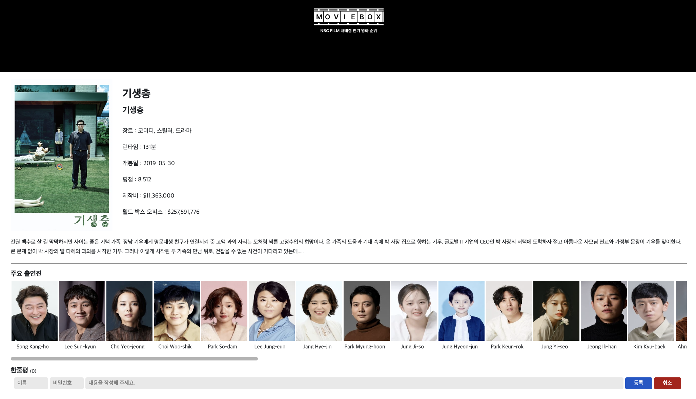
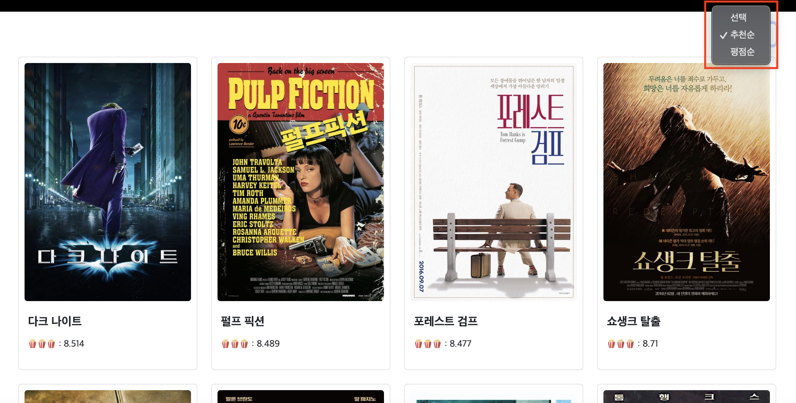
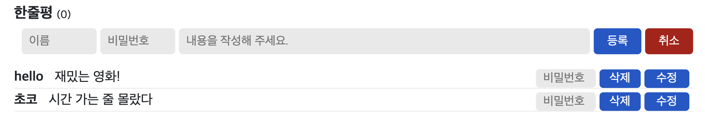
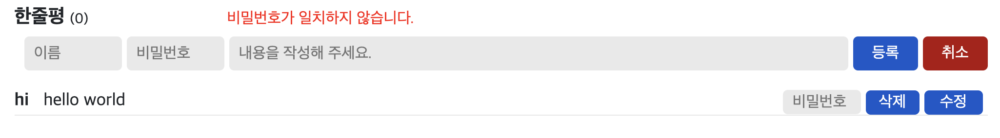
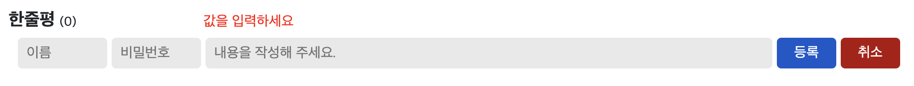
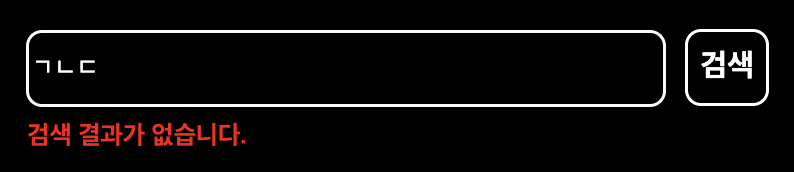
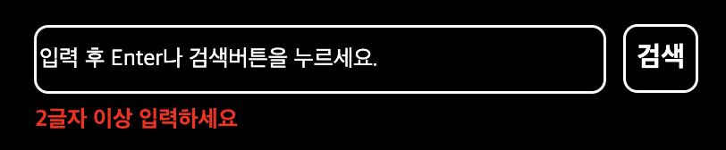
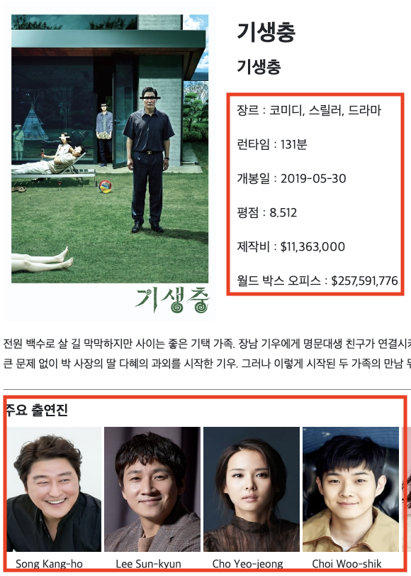

# MOVIE BOX (Javascript Project)

바닐라 자바스크립트\_영화 검색 사이트

 

## 🖥️ 프로젝트 소개

TMDB openAPI를 이용하여 만든 영화 검색 사이트입니다.

 

## 🕰️ 개발 기간

- 24.01.10 - 24.01.15 (6일간)

### 🧑‍🤝‍🧑 맴버구성

- 팀장 : 유한빈

  - 메인화면 검색(검색 API 사용)
  - 상세정보화면 API 데이터 불러오기 및 렌더링
  - localStorage를 활용한 댓글 CRUD
  - webpack 및 babel 적용

- 팀원1 : 곽인해

  - 메인페이지의 영화 카드 추천순/ 평점순 정렬
  - 영화 카드 및 이미지 UI 수정

- 팀원2 : 신준석

  - 메인페이지, 상세페이지의 전체적인 틀 작성
  - TMDB OpenAPI를 이용한 주요 출연진 표현

- 팀원3 : 김현주
  - 헤더 인풋창,검색창, 로고 css 수정
  - 푸터 생성
  - 메인페이지로 화면이동

### ⚙️ 개발 환경

- `Vanilla javascript`, HTML5, CSS3
- **Framework** : Bootstrap(5.3.2)
- **Database** : Local Storage
- **environment** : Visual Studio Code, git, github
- **communication** : figma, slack, notion, zep

 

## 🍿 프로젝트 화면 구성 및 기능

- 메인 페이지

  

 

- 영화 상세 페이지

  

 

- 영화 카드 정렬

  

 

- 한줄평 CRUD(작성, 수정, 삭제)

  

 

- footer

  

   

## 📌 주요 기능

### 필수 구현사항

1. TMDB openAPI 이용

2. 영화정보 상세 페이지 구현

3. 영화 리뷰(한줄평) 작성 기능 구현

   - local storage 적재

4. github PR(=Pull Request) 사용한 협업

5. 유효성 검사

   - 한줄평 작성 시

   - 메인화면 영화 검색 시

6. 순수 `vanilla javascript` 사용

 

### 선택 구현사항

1.  CSS

    - flex, 반응형 구현

2.  상세페이지 한줄평 수정 및 삭제

3.  유효성 검사 - alert이 아닌 input칸 상단/하단에 표시

    - 한줄평 수정, 삭제 시

      

      

       

    - 메인화면 영화 검색

      

      

4.  메인화면 영화 카드 리스트 정렬

    - 추천순, 평점순

      

5.  TMDB openAPI 이용하여 상세 페이지 추가사항 가져오기

    - 출연진, 장르, 런타임, 개봉일, 제작비, 월드 박스 오피스

      

 

## 📝 KPT 회고

### Keep (유지하고 싶은 좋았던 점)

- 한빈

  - ㄱㄴㄷ

- 인해

  - 팀원들 간 소통이 원활했던 점이 가장 좋았습니다. 예를 들면, 현재 진행 상황을 자주 공유해서 최대한 conflict가 안나도록 노력했고, 개인적으로 해결이 어려운 부분은 팀의 이슈로 공유하여 다 함께 해결하고자 했습니다. 각자 맡은 부분의 코드를 함께 리뷰하며 다른 팀원이 맡은 부분의 로직을 이해하는 시간도 가졌습니다. 개발자가 가져야 할 자세 중 중요한 부분이 '소통'과 '공유'라고 많이 들었는데, 원활한 협업을 위해 왜 소통과 공유가 중요한지 몸소 깨달을 수 있는 시간이었습니다.

- 현주

  - ㄱㄴㄷ

- 준석

  - ㄱㄴㄷ

 

### Problem (아쉬웠던 점)

- 한빈

  - ㄱㄴㄷ

- 인해

  - 선택 사항으로 구현하고자 했던 기능 중 구현해내지 못한 부분들이 있어 아쉬움으로 남습니다. 카드를 정렬할 수 있는 종류를 좀 더 늘리고 싶었고(이름순, 장르별 등), 메인페이지에서 페이지네이션도 구현하고 싶었는데 매번 아쉽게 실패해서 결국 완성하지 못해 큰 아쉬움으로 남습니다.

- 현주

  - ㄱㄴㄷ

- 준석

  - ㄱㄴㄷ

 

### Try (Problem 해결 방법, 앞으로의 다짐 등)

- 한빈

  - ㄱㄴㄷ

- 인해

  - 구현해내지 못했던 기능들은 아직 javascript 문법 지식 부족으로 인한 것으로 생각되어 앞으로 기초를 더 탄탄히 하고 다른사람들의 코드도 리뷰해가며 열심히 공부하는 시간을 보내면 자연스레 해결될 것이라 생각합니다.

- 현주

  - ㄱㄴㄷ

- 준석

  - ㄱㄴㄷ
