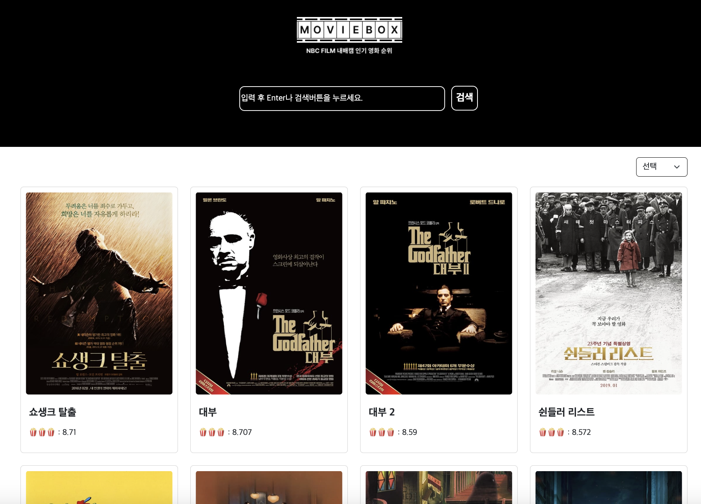

# MOVIE BOX (Javascript Project)

- 바닐라 자바스크립트\_영화 검색 사이트
- 주소 : https://picoloman6.github.io/nbc_TMDB

 

## 🖥️ 프로젝트 소개

TMDB openAPI를 이용하여 만든 영화 검색 사이트입니다.

 

## 🕰️ 개발 기간

- 24.01.10 - 24.01.15 (6일간)

### 🧑‍🤝‍🧑 맴버구성

- 팀장 : 유한빈
  - 메인화면 검색(검색 API 사용)
  - 상세정보화면 API 데이터 불러오기 및 렌더링
  - localStorage를 활용한 댓글 CRUD
  - webpack 및 babel 적용
  - 검색 및 댓글 유효성 검사 적용(throttle)
- 팀원1 : 곽인해
  - 메인페이지의 영화 카드 추천순/ 평점순 정렬
  - 영화 카드 및 이미지 UI 수정
- 팀원2 : 신준석
  - 메인페이지, 상세페이지의 전체적인 틀 작성
  - TMDB OpenAPI를 이용한 주요 출연진 표현
- 팀원3 : 김현주
  - 헤더 인풋창,검색창, 로고 css 수정
  - 푸터 생성
  - 메인페이지로 화면이동

### ⚙️ 개발 환경

- `Vanilla javascript`, `HTML5`, `CSS3`
- **라이브러리** : dotenv
- **Framework** : Bootstrap(5.3.2)
- **Database** : Local Storage
- **environment** : Visual Studio Code, git, github
- **communication** : figma, slack, notion, zep

 

## 🍿 프로젝트 화면 구성 및 기능

- 메인 페이지
  

 

- 영화 상세 페이지
  

 

- 영화 카드 정렬
  

 

- 한줄평 CRUD(작성, 수정, 삭제)
  

 

- footer
  

 

## 📌 주요 기능

### 필수 구현사항

1. TMDB openAPI 이용

   - top rated API, Credit API, 제목 검색 API, 영화 상세정보 API

2. 영화정보 상세 페이지 구현

   - 제목 검색 API로 영화 검색 기능 구현

3. 영화 리뷰(한줄평) 작성 기능 구현

   - localStorage를 활용한 리뷰 CRUD 구현

4. github PR(=Pull Request) 사용한 협업

   - 총 39회 PR
   - main - DEV - feature 브랜치 사용

5. 유효성 검사

   - 한줄평 작성 시
   - 메인화면 영화 검색 시

6. 순수 `vanilla javascript` 사용

 

### 선택 구현사항

1.  CSS

    - flex, 반응형 구현

2.  상세페이지 한줄평 수정 및 삭제

3.  유효성 검사 - alert이 아닌 input칸 상단/하단에 표시

    - 한줄평 수정, 삭제 시
      

      

       

    - 메인화면 영화 검색

      

      

4.  메인화면 영화 카드 리스트 정렬

    - 추천순, 평점순

         

5.  TMDB openAPI 이용하여 상세 페이지 추가사항 가져오기

    - 출연진, 장르, 런타임, 개봉일, 제작비, 월드 박스 오피스

      

6.  throttle

    - 연속적인 검색 제한으로 API 요청 감소
      

 

## 📝 KPT 회고

### Keep (유지하고 싶은 좋았던 점)

- 한빈

  - 프로젝트를 완성하고 배포까지 완료
  - API 통신에 대한 비동기 코드 깔끔하게 작성
  - 유효성 검사를 깔끔한 UI로 작성

- 인해

  - ㄱㄴㄷ

- 현주

  - ㄱㄴㄷ

- 준석

  - ㄱㄴㄷ

 

### Problem (아쉬웠던 점)

- 한빈

  - 라이브러리 import 후 번들 파일 크기 줄이지 못한 것
  - 파일 하나에 많은 코드를 작성한 것

- 인해

  - ㄱㄴㄷ

- 현주

  - ㄱㄴㄷ

- 준석

  - ㄱㄴㄷ

 

### Try (Problem 해결 방법, 앞으로의 다짐 등)

- 한빈

  - 남은 기간 동안 번들 파일 크기 최적화 배우기
  - trottle, debounce 더 많이 사용하기

- 인해

  - ㄱㄴㄷ

- 현주

  - ㄱㄴㄷ

- 준석

  - ㄱㄴㄷ
